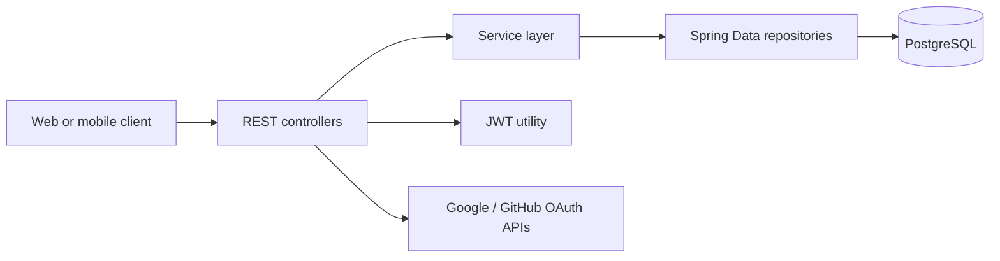
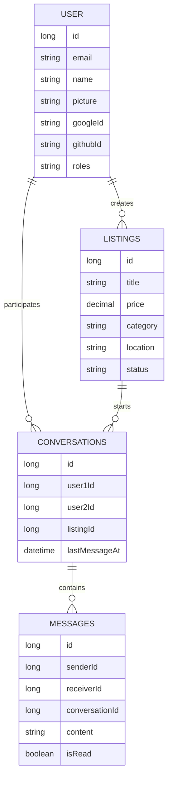

# Marketplace App Backend


This repository is a Spring Boot REST API for a neighborhood marketplace where users can create listings, discover local deals, authenticate through multiple sign-in flows, and message other users about items.

## What This Demonstrates

- Built a Java 17 / Spring Boot 3 backend with Gradle and layered controller, service, repository, entity, and DTO packages.
- Modeled a marketplace domain with users, listings, conversations, and messages persisted through Spring Data JPA.
- Implemented email/password authentication, BCrypt password hashing, JWT token generation, Google sign-in handoff, and GitHub OAuth code exchange.
- Added marketplace discovery through active listings, user listings, category filtering, and keyword search.
- Supported buyer-seller messaging with paginated conversations, ordered message history, and read/unread state updates.
- Prepared the app for hosted deployment with environment-based configuration, PostgreSQL, Java 17 runtime settings, and a Procfile.

## Core Features

### Authentication

- Email/password signup and login.
- Password hashing with BCrypt.
- JWT generation with email and user id claims.
- Google auth handoff for users authenticated on the client.
- GitHub OAuth exchange with support for separate web and mobile client credentials.
- Account linking by email when a user signs in through multiple providers.

### Marketplace Listings

- Create, read, update, delete, and status-update listing flows.
- Active listing feed ordered by newest first.
- Filter listings by user or category.
- Search listings by title and description.
- Listing DTOs include seller name and profile picture for frontend display.

### Conversations And Messaging

- Create or reuse one conversation per buyer, seller, and listing.
- List a user's conversations with pagination and newest activity first.
- Send messages inside a conversation.
- Fetch ordered message history.
- Mark messages as read or unread.

## Tech Stack

| Area | Technology |
| --- | --- |
| Language | Java 17 |
| Framework | Spring Boot 3.5.7 |
| API | Spring Web REST controllers |
| Security | Spring Security, BCrypt, JWT |
| Persistence | Spring Data JPA, Hibernate |
| Database | PostgreSQL |
| Build | Gradle Wrapper |
| Config | Environment variables with `spring-dotenv` |

## Architecture





## API Overview

### Auth

| Method | Endpoint | Purpose |
| --- | --- | --- |
| `POST` | `/api/auth/signup` | Register a user with email, name, and password. |
| `POST` | `/api/auth/login` | Authenticate with email/password and receive a JWT. |
| `POST` | `/api/auth/google` | Create or update a user from Google profile data. |
| `POST` | `/api/auth/github` | Exchange a GitHub auth code, fetch profile/email data, and receive a JWT. |

### Users

| Method | Endpoint | Purpose |
| --- | --- | --- |
| `GET` | `/api/user/me` | Resolve the current user from an authorization header. |
| `GET` | `/api/user/all` | Fetch all users. |
| `GET` | `/api/user/by-email?email=` | Look up a user by email. |
| `GET` | `/api/user/by-userid?userid=` | Look up a user by id. |

### Listings

| Method | Endpoint | Purpose |
| --- | --- | --- |
| `GET` | `/api/listings` | Fetch all active listings. |
| `POST` | `/api/listings` | Create a new listing. |
| `GET` | `/api/listings/{id}` | Fetch one listing by id. |
| `GET` | `/api/listings/user/{userId}` | Fetch listings for a specific seller. |
| `GET` | `/api/listings/my-listings` | Fetch listings for the authenticated user. |
| `GET` | `/api/listings/category/{category}` | Fetch active listings in a category. |
| `GET` | `/api/listings/search?keyword=` | Search listing title and description. |
| `PUT` | `/api/listings/{id}` | Update a listing. |
| `PATCH` | `/api/listings/{id}/status?status=` | Update listing status. |
| `DELETE` | `/api/listings/{id}` | Delete a listing. |

### Conversations And Messages

| Method | Endpoint | Purpose |
| --- | --- | --- |
| `POST` | `/conversations` | Create or reuse a conversation for two users and a listing. |
| `GET` | `/conversations?userId=&page=&size=` | List a user's conversations with pagination. |
| `GET` | `/conversations/{conversationId}/messages` | Fetch paginated message history. |
| `POST` | `/conversations/{conversationId}/messages` | Send a message in a conversation. |
| `PATCH` | `/conversations/{conversationId}/messages/{messageId}/read` | Mark a message as read. |
| `PATCH` | `/conversations/{conversationId}/messages/{messageId}/unread` | Mark a message as unread. |

## Local Development

### Prerequisites

- Java 17
- PostgreSQL
- Git
- The included Gradle wrapper (`./gradlew`)

### 1. Clone The Repository

```bash
git clone <repo-url>
cd MarketPlace_App_Backend
```

### 2. Configure Environment Variables

Create a local `.env` file in the project root. Do not commit this file.

```bash
DB_URL=jdbc:postgresql://localhost:5432/hood_deals
DB_USERNAME=your_database_user
DB_PASSWORD=your_database_password

GOOGLE_CLIENT_ID=your_google_client_id
GOOGLE_CLIENT_SECRET=your_google_client_secret

CLIENT_ID=your_github_mobile_client_id
CLIENT_SECRET=your_github_mobile_client_secret
WEB_CLIENT_ID=your_github_web_client_id
WEB_CLIENT_SECRET=your_github_web_client_secret

JWT_SECRET=replace_with_a_64_plus_character_secret_for_hs512_signing
JWT_EXPIRATION=86400000
SERVER_PORT=8080
```

### 3. Run The API

```bash
./gradlew bootRun
```

The API will start on the port configured by `SERVER_PORT`, usually:

```text
http://localhost:8080
```
